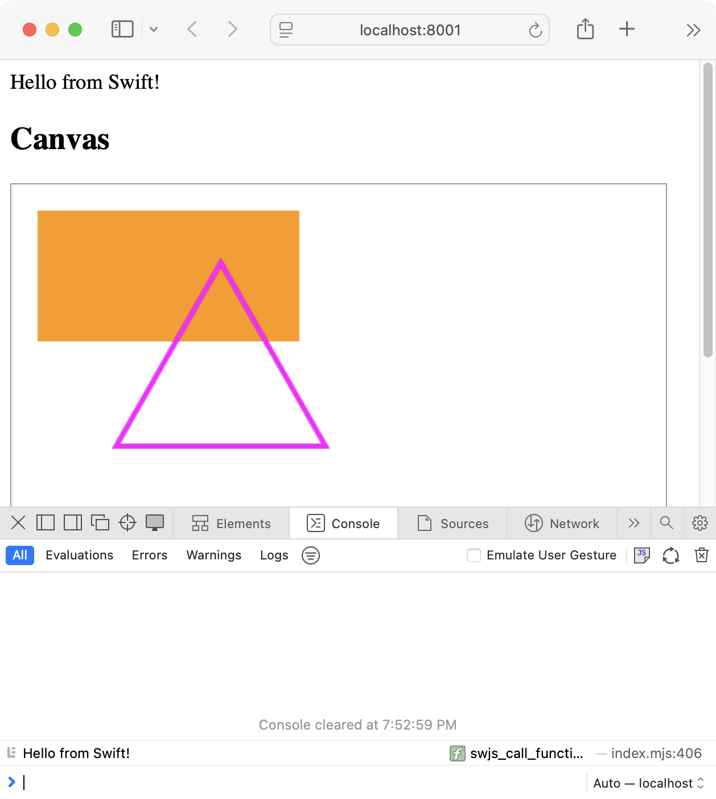

A simple WebAssembly module that uses JavaScriptKit to manipulate the DOM, built with SwiftPM in Embedded Swift mode. Inspired by [Simon Leeb, Web App with Embedded Swift - POC demo (2024-10-20)](https://forums.swift.org/t/web-app-with-embedded-swift-poc-demo/75486).

As of 2025-01, you need a current Swift development toolchain to build this, at least on macOS. To run this, build the Wasm binary with `make wasmlib`, then start a local web server with `make server`.

The build steps are documented in the `Makefile`. You’ll probably have to modify them if:

- You’re not on macOS, or
- You are on macOS, but your installed Swift toolchain is not in `~/Library/Developer/Toolchain/swift-latest.xctoolchain`, or
- You don’t have Python installed (used to start a local web server) or you want to use another tool to run a local web server.

This is the resulting web page in the browser:

